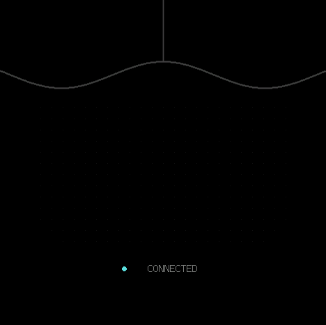

# M5StopWatch BLE Mouse

Turn an M5Stack StopWatch into a Bluetooth Low Energy mouse with a round touch trackpad, on-screen left/right buttons, and physical scroll buttons. It uses standard HID over GATT; the host does not need a companion application.



*Internal framebuffer rendering, not a photograph of the physical display.*

## Features

- Relative pointer movement with fractional motion accumulation.
- Tap to left-click; hold still for at least 0.5 seconds and release to right-click.
- Double-tap and keep the second touch down to left-drag.
- Hold either on-screen button with one finger and move another finger on the trackpad to drag with that button.
- Physical buttons for wheel scrolling, with repeat on hold.
- Encrypted BLE pairing, reconnect advertising, and a battery service.
- Per-device advertising name, `StopWatch XXXX`, generated from the last two bytes of the factory base MAC address.

## Hardware and dependencies

This firmware targets the [M5Stack StopWatch](https://docs.m5stack.com/en/core/StopWatch): ESP32-S3R8, 16 MB flash, 8 MB PSRAM, CO5300 AMOLED, and CST820B touch controller. The panel is marketed as 466 × 466; its software address window is 468 × 466 with a six-pixel horizontal offset, following the board's display configuration.

| Component | Version |
| --- | --- |
| Arduino CLI | 1.5.1 |
| M5Stack Arduino core | `m5stack:esp32@3.3.7` |
| M5GFX | 0.2.26 |
| Board FQBN | `m5stack:esp32:m5stack_stopwatch` |

M5GFX supplies software canvases only. The firmware initializes the board directly and does not require M5Unified or a separate BLE mouse library.

## Build

Install [Arduino CLI](https://arduino.github.io/arduino-cli/latest/installation/), then run these commands from the repository root. They work in a POSIX shell or PowerShell:

```sh
arduino-cli core update-index --additional-urls https://static-cdn.m5stack.com/resource/arduino/package_m5stack_index.json
arduino-cli core install m5stack:esp32@3.3.7 --additional-urls https://static-cdn.m5stack.com/resource/arduino/package_m5stack_index.json
arduino-cli lib install "M5GFX@0.2.26"
arduino-cli compile -b m5stack:esp32:m5stack_stopwatch --build-path .build/release --warnings all stopwatch_mouse
```

Alternatively, after installing the core, the PowerShell helper downloads the pinned M5GFX version into `.build/deps/` and compiles without replacing libraries in your Arduino user directory:

```powershell
./build.ps1
```

Build output is written to `.build/release/`. Use `-BuildRoot <directory>` to choose another local build root. Source files are compiled directly from `stopwatch_mouse/`.

To enable detailed HID/GAP logs:

```powershell
./build.ps1 -DebugLog
```

The equivalent compile option is `--build-property "compiler.cpp.extra_flags=-DSTOPWATCH_MOUSE_DEBUG=1"`. Use a separate build path such as `.build/debug` for this configuration. Normal builds suppress routine debug messages. Initialization, authentication, I2C, and HID notification errors remain visible on Serial in both configurations.

## Flash

Connect the StopWatch by USB and find its port:

```sh
arduino-cli board list
arduino-cli upload -p <PORT> -b m5stack:esp32:m5stack_stopwatch --input-dir .build/release
```

Replace `<PORT>` with the port listed for your device. Uploading installs this application in place of the current firmware. If the device does not enter its bootloader automatically, follow the [official download-mode instructions](https://docs.m5stack.com/en/core/StopWatch).

## Pair and use

1. Power on the StopWatch and pair with `StopWatch XXXX` in the host's Bluetooth settings.
2. Release all controls after connecting. Input begins after encryption and HID notification setup.
3. Move a finger below the curved divider to move the pointer. The two regions above the divider are the left and right mouse buttons.

| Action | Gesture |
| --- | --- |
| Move pointer | Slide one finger on the lower trackpad |
| Left-click | Tap and release within 0.5 seconds, or press/release the upper-left region |
| Right-click | Hold still for at least 0.5 seconds and release, or press/release the upper-right region |
| Double-click | Tap twice in the same area |
| Left-drag with one finger | Tap, then touch again within 300 ms and keep that second touch down while moving; lift to release |
| Left/right drag with two fingers | Hold the corresponding upper button, move another finger on the lower trackpad; release the button finger to end the drag |
| Scroll down | Press the yellow physical button (GPIO2) |
| Scroll up | Press the blue physical button (GPIO1) |
| Repeat scroll | Hold a physical button; repeat starts after 400 ms, then every 90 ms |

A tap allows up to eight pixels of contact movement. Exceeding that distance cancels the release-click even if the finger returns to its starting position. The second touch of a double-tap must begin within 32 pixels of the first. Drag gestures suppress long-press right-clicks. Physical buttons remain scroll controls.

On iPhone/iPad, pointer access may require enabling AssistiveTouch in Accessibility → Touch. Host settings determine pointer speed, wheel direction, and the double-click timing recognized by applications.

## Diagnostics

Open the USB serial port at **115200 baud**, with **DTR and RTS disabled**. Commands do not need a newline:

| Command | Result |
| --- | --- |
| `?` | Advertising name, connection/encryption/subscription state, notification counters, touch validity and coordinates |
| `T` | Toggle a 20 Hz touch/input trace; issue again to stop |
| `P` | Dump the internal framebuffer as a binary P6 PPM image |

The explicit commands work in normal builds. Disable touch tracing before capturing a framebuffer. A framebuffer dump shows software rendering; it does not measure the physical panel output. Invalid touch input cancels the gesture and requires all fingers to be lifted before input resumes.

## Design

- **Contact tracking:** up to two controller contact IDs are tracked independently. Each contact keeps the zone in which it began, so crossing the curved divider cannot change a pointer gesture into a button press. Contact record order does not determine pointer ownership.
- **Gesture logic:** `MouseGestures.h`, `TouchFrame.h`, and `TouchMouse.h` are independent of Arduino and BLE. Timing is passed in explicitly for deterministic tests, including clock wraparound.
- **Display:** M5GFX renders RGB565 canvases in PSRAM. ESP-IDF `spi_master` transfers changed rectangles over direct 20 MHz QSPI in DMA strips. Rendering is limited to one update per 40 ms.
- **Board startup:** I2C runs at 100 kHz. IO-expander readiness requires a successful register read; startup retries include the board's wake delay. Display/touch reset follows confirmation of panel power. Charging-current configuration is preserved.
- **HID identity:** the PnP vendor field stays at the reserved test value `0xffff`; the project does not claim another manufacturer's assigned identity. Advertising and diagnostic output use the same generated name.
- **Battery:** the PMIC voltage is mapped linearly from 3300–4200 mV to 0–100%, refreshed every minute. It is an approximate indicator, not a calibrated fuel gauge.

Timing and geometry constants are in `MouseConfig.h`. Pointer sensitivity is in `TouchMouse.h`.

## Limitations and validation scope

- Hardware coverage is one M5StopWatch, with BLE mouse connections exercised on Windows and iOS. Gesture regression tests use synthetic contact frames. Compatibility with other hosts depends on their BLE HID support.
- Two-finger dragging requires the panel firmware to report two distinct contacts with stable IDs. Closely spaced contacts can merge on capacitive panels. The one-finger double-tap drag avoids that dependency.
- At most two contacts are handled. There is no pinch gesture, middle-button gesture, horizontal wheel, or drag lock after lifting all fingers.
- The firmware keeps the display active; automatic display sleep and battery-life optimization are outside its current feature set.
- The display implementation uses direct QSPI. It does not initialize an M5GFX hardware panel.

## Tests and CI

Host tests cover click timing at 499/500 ms, movement cancellation, double-tap drag and release, both button drags, contact reordering, finger repositioning, invalid input recovery, touch decoding, and timer wraparound:

```sh
mkdir -p .build
c++ -std=c++17 -Wall -Wextra -Werror tests/gestures_test.cpp -o .build/gestures_test
.build/gestures_test
```

GitHub Actions runs the host tests and compiles both normal and debug firmware with the pinned board core and M5GFX version.

## License and acknowledgments

Project code is available under the [MIT License](LICENSE). Board startup and display-register references come from M5Stack's MIT-licensed M5StopWatch-UserDemo. Thanks to M5Stack, the M5GFX/LovyanGFX contributors, and the authors of the CST8xx protocol references. See [NOTICE.md](NOTICE.md) for exact source revisions and third-party license information.
